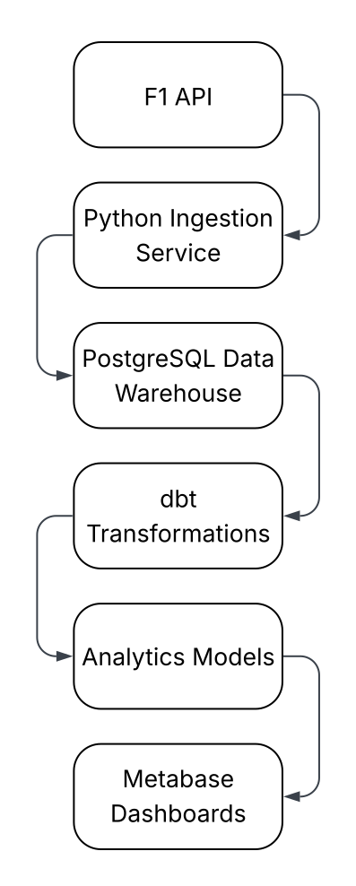
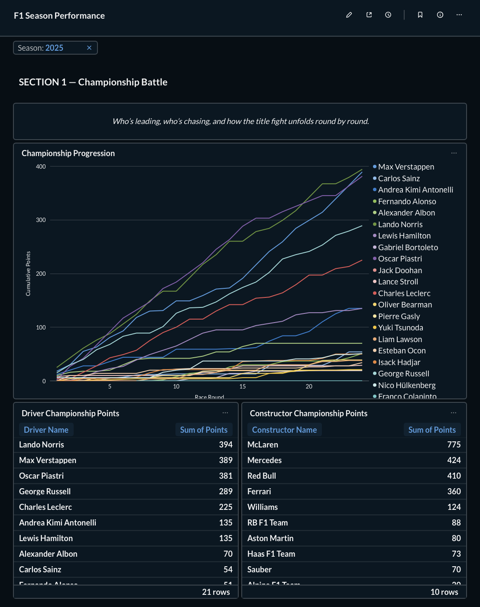
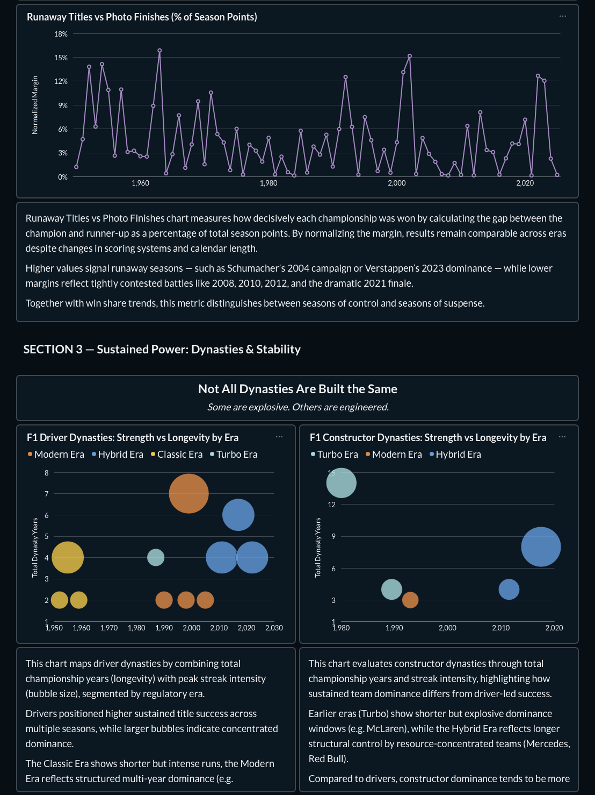
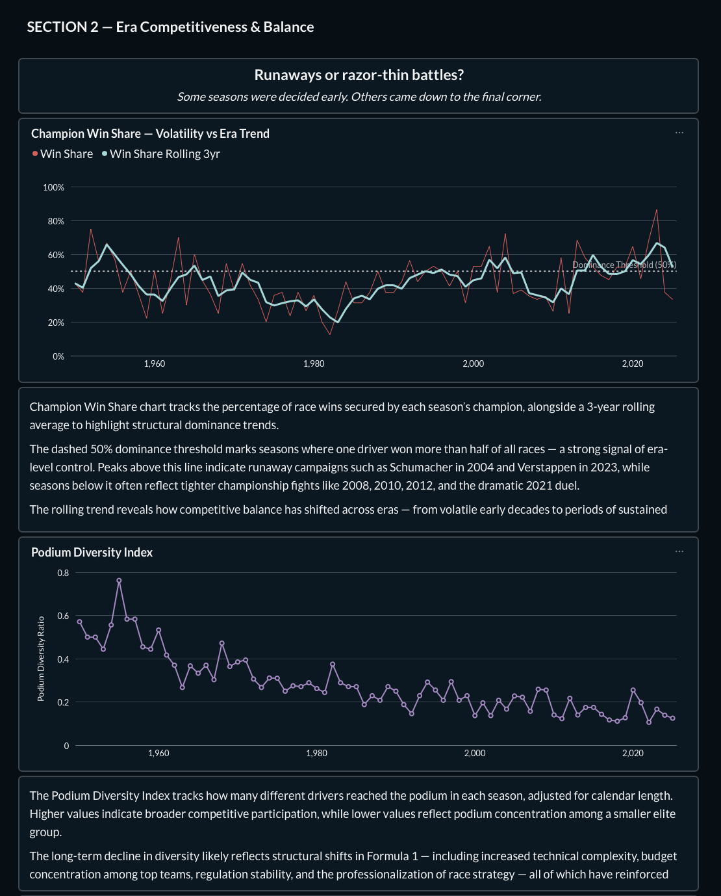
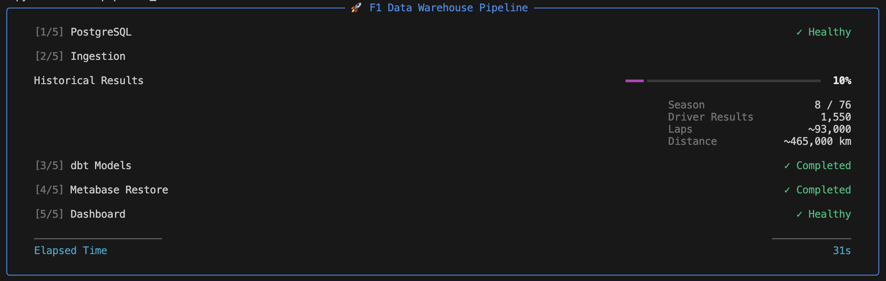
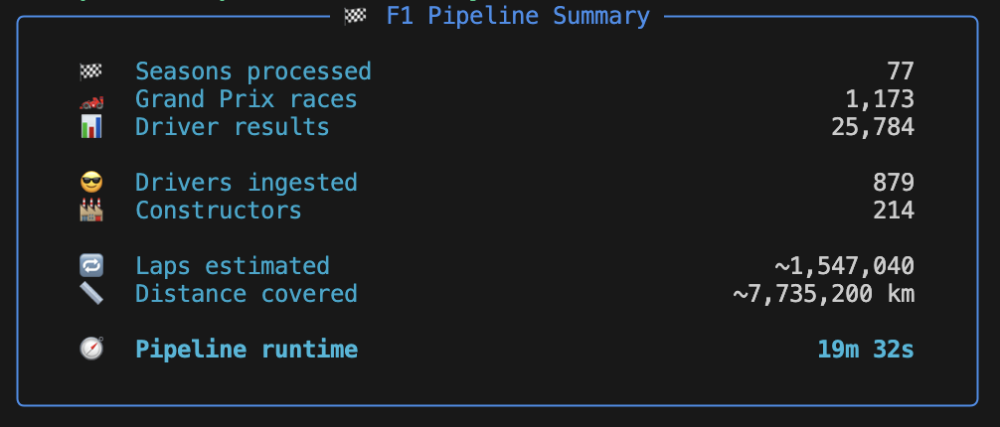
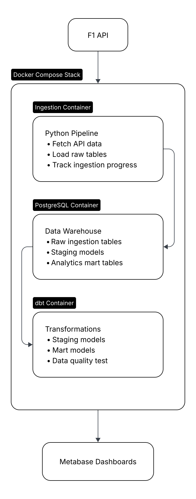

# 🏎️ Formula 1 Data Warehouse

An **end-to-end Data Engineering project** that builds an analytics-ready data warehouse for Formula 1 race data.

The project ingests data from an external API, loads it into PostgreSQL, transforms it using dbt, and exposes analytics through Metabase dashboards.

This project was built as part of my **Cloud Data Engineer portfolio**, focusing on realistic data engineering practices such as:
- containerized infrastructure
- modular pipelines
- transformation layers
- analytics-ready marts
- automated orchestration

The result is a fully reproducible pipeline that turns raw API data into meaningful racing insights.


## 🏁 What This Project Does
This pipeline takes raw Formula 1 data and transforms it into a queryable analytics warehouse.

<p align="center">
  
  <br>
  <em>Project workflow diagram</em>
</p>
The pipeline is fully containerized and runs locally using Docker Compose, making it easy to reproduce the full data stack.

## 📊 Example Analytics 
The warehouse powers multiple dashboards built in Metabase.

Examples include:
- Driver performance comparisons
- Constructor standings trends
- Race results analysis
- Season statistics

### F1 Driver Season Performance Analysis 

<p align="center">
  
  <br>
  <em>Who's leading, who's chasing, and how the title fight unfolds round by round.</em>
</p>

---

### F1 Long-Term Insights: Dynasties & Stability Analysis

<p align="center">
  
  <br>
  <em>Not all dynsaties are built the same. Some are explosive. Others are engineered.</em>
</p>

---

### F1 Long-Term Insights: Era Competitiveness & Balance Analysis

<p align="center">
  
  <br>
  <em>Runaways or razor-thin battles? Some seasons were decided early. Others came to the final corner.</em>
</p>

---

### Pipeline CLI Dashboard

You can also monitor the pipeline directly from the CLI dashboard:

<p align="center">
  
  <br>
  <em>Terminal dashboard for monitoring pipeline execution.</em>
</p>

---

### Pipeline Summary CLI Dashboard

<p align="center">
  
  <br>
  <em>Terminal dashboard for pipeline summary.</em>
</p>

---

The goal of this project is not only to analyze F1 data but also to demonstrate how a **modern data stack can be built from scratch.**


## ⚙️ Tech Stack

| Layer | Tool | Description |
|------|------|-------------|
| Containerization | Docker Compose | Orchestrates the full data platform locally |
| Data Source | Ergast F1 API | External API providing Formula 1 race data |
| Data Ingestion | Python | Collects and loads API data into the warehouse |
| Data Warehouse | PostgreSQL | Central analytical warehouse storing raw and transformed datasets |
| Transformation & Modeling | dbt | Builds staging models and analytics marts using a layered architecture |
| Data Quality & Testing | dbt tests | Validates model integrity (`not_null`, `unique`, `relationships`) |
| Query Language | SQL | Used for analytics modeling and transformations |
| BI / Analytics | Metabase | Interactive dashboards and data exploration |
| Pipeline Monitoring | Python CLI Dashboard | Terminal dashboard for monitoring pipeline execution |
| Configuration | Environment Variables (.env) | Environment-based configuration for credentials and services |


## ⭐️ Key Engineering Features

• **End-to-End Data Pipeline**  
  Raw Formula 1 data is ingested from an external API, transformed with dbt, and exposed through analytics dashboards.

• **Containerized Data Stack**  
  The entire infrastructure runs locally using Docker Compose, ensuring reproducible environments and easy setup.

• **Layered Data Modeling with dbt**  
  The warehouse follows a structured modeling approach:
  - **staging models** clean and standardize raw data
  - **mart models** create analytics-ready fact and dimension tables

• **Automated Pipeline Execution and Dependency Handling**  
  The dbt container waits for ingestion to complete before running transformations, ensuring proper pipeline ordering.

• **Environment-Based Configuration**  
  Database credentials and configuration are managed through environment variables for flexibility and security.

• **Interactive Analytics Layer**  
  Metabase dashboards allow exploration of driver performance, race results, and constructor standings as well as long-term insights into 75 years of rich history.

• **Pipeline Monitoring CLI**  
  A custom Python CLI dashboard provides visibility into pipeline progress and ingestion status.

## 🏗️ Data Pipeline Architecture

The pipeline is implemented as a containerized data stack orchestrated with Docker Compose.  
Each stage of the pipeline runs as an isolated service and communicates through the central PostgreSQL data warehouse.

<p align="center">
  
  <br>
  <em>Data pipeline architecture diagram</em>
</p>

The system consists of three core data platform services and an external analytics layer.

### 1️⃣ Ingestion Container (Python)

The ingestion service is responsible for collecting Formula 1 race data from the external F1 API and loading it into the warehouse.

Key responsibilities:

- Fetch race, driver, constructor, and results data from the API
- Load raw datasets into PostgreSQL ingestion tables
- Track ingestion progress and execution state
- Write pipeline logs for monitoring and debugging

The ingestion pipeline includes handling for:

- API pagination
- rate limits
- seasonal batch ingestion

This container executes the Python ingestion pipeline and acts as the entry point of the data flow into the warehouse. The ingestion pipeline is designed to be **idempotent**, allowing safe re-execution without creating duplicate records.


### 2️⃣ PostgreSQL Container (Data Warehouse)

PostgreSQL serves as the central analytical data warehouse and persistence layer for the pipeline.  
All services interact with the warehouse, making it the central data hub of the system.

The warehouse is organized using schema-based separation that reflects the layered transformation architecture:

- `public` → raw ingestion tables loaded directly from the API  
- `staging` → cleaned and standardized transformation layer built by dbt  
- `analytics` → analytics-ready fact and dimension tables optimized for BI queries

This layered structure allows the pipeline to separate raw data ingestion from transformation logic and analytical modeling, improving maintainability and query performance.

### 3️⃣ dbt Container (Transformation Layer)

Data transformations are performed using **dbt (data build tool)**.

The dbt container runs transformation jobs that convert raw ingestion tables into analytics-ready datasets. The analytics layer follows a **star schema design**, consisting of dimension tables and a central fact table optimized for analytical queries and BI workloads.

The transformation workflow follows a layered modeling approach:

**Staging Layer**
- Cleans raw API data
- Standardizes naming conventions
- Normalizes schema structures

**Mart Layer**
- Builds fact and dimension tables
- Creates analytics-ready datasets
- Optimizes query performance for BI tools


**Data Quality & Testing**

Data quality is enforced using built-in dbt tests.

The pipeline validates key integrity constraints including:

- `not_null` checks on primary keys
- `unique` constraints for dimension identifiers
- `relationships` tests to ensure referential integrity between fact and dimension tables

These tests run automatically after model builds to verify the integrity of the analytics layer.


### 4️⃣ Analytics Layer (Metabase)

The final analytics layer is powered by **Metabase**, which connects directly to the PostgreSQL warehouse. 

Metabase provides interactive dashboards that enable exploration of:

- driver performance
- constructor standings
- race results
- season statistics

Business users can query the analytics mart tables through a visual interface without interacting directly with the underlying database.

## 🐳 Infrastructure

The entire platform is deployed locally using **Docker Compose**, which orchestrates the runtime services required for the pipeline.

The stack includes the following containers:

- **Ingestion container** – Python data ingestion pipeline  
- **PostgreSQL container** – analytical data warehouse  
- **dbt container** – transformation, data modeling and data integrity environment

Container dependencies ensure the pipeline executes in the correct order. The dbt service waits for the ingestion process to complete before executing transformations.
This dependency ensures that transformations operate on a fully populated raw data layer.


## Warehouse Schema


## How to Run Locally

### Prerequisites

Before running the project locally, ensure you have the following installed:

- **Git**
- **Docker & Docker Compose**
  - https://docs.docker.com/get-docker/


### ⏱️ Execution Time

Execution time depends primarily on API rate limits during ingestion.

Typical runtimes:
- **Full historical ingestion**: ~25–30 minutes  
  (~28,000 race result records)
- **dbt transformations & tests**: < 1 minute

The pipeline is idempotent and safe to re-run. Subsequent runs may complete faster if data already exists.

### 💾 Local Resource Usage (Approximate)

Docker resources used by the pipeline (measured on a clean run):

#### Docker Images

- **metabase/metabase:latest** → 1.56 GB  
- **docker-ingestion** → 881 MB  
- **dbt-postgres (1.9.latest)** → 883 MB  
- **postgres:18** → 671 MB  

> Total image footprint: ~4.0 GB

#### Persistent Data (Docker Volumes)

- **PostgreSQL warehouse data** → ~103 MB  
- **Metabase application data** → grows over time (initial seed: ~0 MB)  
- **Ingestion state volume** → negligible  

> Total persistent warehouse footprint after full ingestion: ~100 MB

#### Runtime Memory Usage (Idle State)

- **Metabase** → ~1.0 GB RAM  
- **PostgreSQL** → ~80 MB RAM  
- Other services run briefly during ingestion & transformation.

#### Docker Build Cache

- ~950 MB (can be safely pruned if needed)

---

*These resources are typical for a fully containerized local analytics stack and can be completely removed using:*

```bash
docker compose down -v
```

### 1️⃣ Local Environment Setup

  Clone the repository

  ```bash
  git clone https://github.com/SebastianSwiczerewski/f1_data_warehouse.git
  cd f1_data_warehouse/
  ```

  Create a local .env file from the example provided. No edits required for local runs.

  ```bash
  cp .env.example .env
  ```

### 2️⃣ Run the Entire Pipeline
  The entire data pipeline is orchestrated through Docker Compose and can be executed with a **single command**.

  ```bash
  cd docker/
  docker compose --env-file ../.env up --build
  ```

  This command is the **core entry point** of the project. It provisions infrastructure, ingests data, and builds analytics models, starts the BI layer, and restores dashboards - fully automated and end-to-end.

  The system is ready once the terminal displays:

  ```bash
  🚀 F1 DATA WAREHOUSE IS READY 🚀
  ```

Under the hood, it performs the following steps:

1. **Provision the Warehouse**
   - Starts a PostgreSQL container
   - Initializes schemas and persistent storage
   - Creates the Metabase application database

2. **Ingest Raw Formula 1 Data**
   - Executes Python ingestion pipelines
   - Pulls historical data from the Ergast API
   - Handles pagination, retries, and API rate limits
   - Loads data into raw tables in the `public` schema

3. **Transform & Validate Data with dbt**
   - Builds staging models as views (`dbt_staging`)
   - Builds analytics-ready marts as tables (`dbt_analytics`)
   - Executes data quality tests:
     - `not null`
     - `unique`
     - `relationships`

4. **Start Metabase (BI Layer)**
   - Launches Metabase as a containerized service
   - Connects it automatically to the warehouse
   - Configues the application database

5. **Automatically Restore Pre-Built Dashboards**
   - Restores a pre-configured Metabase environment from a version-controlled database seed 
   - Restores:
     - F1 Season Performance
     - F1 Long-Term Insights
   - Applies all saved filters, formatting and visual styling (no manual dashboard setup required)
    

Once this step completes successfully, the warehouse and BI layer are **fully analytics-ready**.

### 3️⃣ Access the Dashboards

Once the pipeline completes, open in a web browser:

```bash
http://localhost:3000
```
The Metabase instance is automatically provisioned and restored from a version-controlled seed file, ensuring identical dashboards across environments without any manual configuration.

Login with

```bash
Email: f1@metabase.com  
Password: Alonso1
```

Navigate to:

```bash
Our Analytics → F1 Dashboards
```
You will find:

- **F1 Long-Term Insights**
- **F1 Season Performance**

All dashboards are fully configured, including:

- Saved questions  
- Filters  
- Formatting  
- Visual styling  
- Data model mappings  

No manual setup is required.

### 4️⃣ Validate the Warehouse (Optional)

  ```bash
  cd docker/
  docker exec -it f1_postgres psql -U f1_user -d f1_raw
  ```
  
  List schemas:

  ```bash
  \dn                
  ```
  You should see the following schemas:

  - **public** → raw tables  
  - **dbt_staging** → staging views  
  - **dbt_analytics** → dimension & fact tables

  ```bash
  \dt public.*          # List of raw tables
  \dv dbt_staging.*     # List of staging views
  \dt dbt_analytics.*   # List of dimension & fact tables
  ```


  Other useful commands

  ```bash
  \dt                 # List tables
  \dv                 # List views
  \d table_name       # Describe table
  \q                  # Exit
  ```

  For example analytics queries using fact and dimension models check ./f1_dbt/analyses/f1_analytics.sql


### 5️⃣ Tear Down Local Environment

  Stop Docker services (keep data)

  ```bash
  docker compose down
  ```

  ⚠️ WARNING: This deletes data

  ```bash
  docker compose down -v
  ```


## Pipeline Summary

This project demonstrates a production-style ELT + BI architecture where:
- Infrastructure is fully containerized (PostgreSQL, ingestion, dbt, Metabase)
- Ingestion and transformation are decoupled
- dbt enforces modeling standards and data quality
- Analytics marts are built using dimensional modeling principles
- The BI layer is automatically provisioned and restored

The Metabase container automatically restores a pre-configured BI environment from a version-controlled SQL seed file (metabase_seed.sql), ensuring identical dashboards across environments.

Running a single command:

```bash
docker compose --env-file ../.env up --build
```

provisions infrastructure, ingests historical F1 data, builds analytics models, and launches fully configured dashboards — end-to-end and reproducibly.